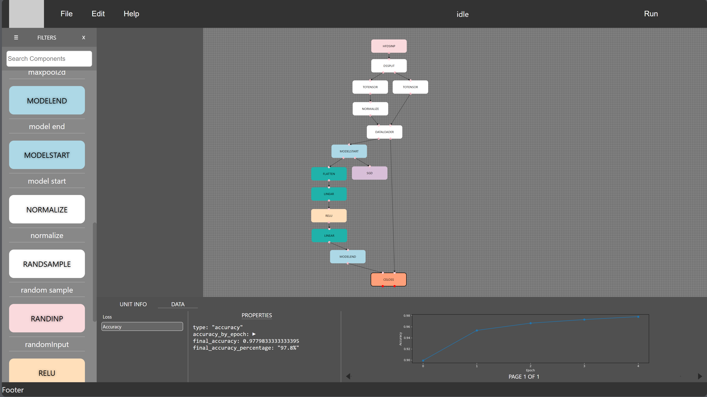

# NeuralNetworkBuilder

创建神经网络流程图并使用PyTorch进行训练和推理。

## 语言
- [English](README_EN.md)
- [中文](README_CN.md)

## 使用

克隆仓库
```
git clone https://github.com/cwc020730/NeuralNetworkBuilder.git
```

下载 [Node.js](https://nodejs.org/) 和 [npm](https://www.npmjs.com/)。
下载 [Python](https://www.python.org/downloads/) 和 [pip](https://pip.pypa.io/en/stable/installation/)。

确保含有 `npm`, `pip` 和 `python` 可执行文件的路径在系统环境变量 `PATH` 下。

进入frontend路径:
```
cd frontend
```

下载需要的库:
```
npm install
```

在终端中启动前端:
```
npm start
```

`npm start` 会在 `http://localhost:3000` 启动。

在另一个终端中，启动后端:
```
pip install -r backend/requirements.txt
pip install -r backend/requirements_pytorch.txt
python -m backend.backend
```
后端会在 `http://localhost:5000` 运行。

## 例子



在 `http://localhost:3000` 使用 File -> Import 并选择 `examples/simple_net_for_mnist.json` 来加载和图片一样的神经网络。
点击 Run 按钮以训练。
现在所有的训练时的状态都在执行 `python -m backend.backend` 的终端中显示。

每个训练 epoch 后, 损失和准确率会在 CELOSS 单元的 data 里面更新，并显示变化图。

## 贡献

任何形式的贡献都可以。欢迎任何的联系和讨论。

## 联系方式

- QQ: 1766797600
- Discord用户名: hh4939
- 邮箱: xxzhangjinghexx@gmail.com
