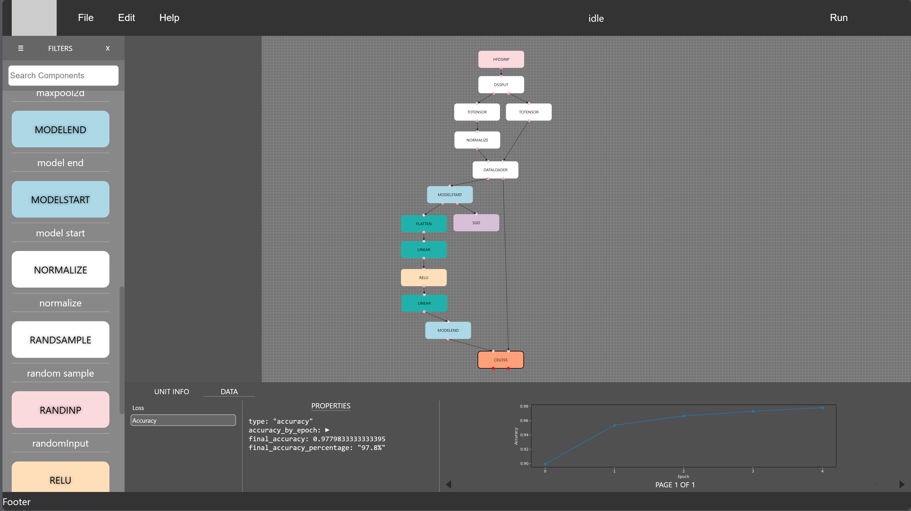

# NeuralNetworkBuilder

Create flowcharts of neural networks and convert the flowcharts into PyTorch for inferencing/training.

## Languages
- [English](README_EN.md)
- [中文](README_CN.md)

## How to run the project

Clone this repository
```
git clone https://github.com/cwc020730/NeuralNetworkBuilder.git
```

Install [Node.js](https://nodejs.org/) and [npm](https://www.npmjs.com/)
Install [Python](https://www.python.org/downloads/) and [pip](https://pip.pypa.io/en/stable/installation/)

Make sure the directory of `npm`, `pip` and `python` executables are in the system environment variable `PATH`

Install relevant packages:
```
npm install
```

In a terminal, start the frontend:
```
npm start
```

`npm start` should start the app locally: `http://localhost:3000`.

In another terminal, start the backend:
```
pip install -r backend/requirements.txt
pip install -r backend/requirements_pytorch.txt
python -m backend.backend
```
The backend server should start locally: `http://localhost:5000`.

## Example



You may use File -> Import on `http://localhost:3000` and select `examples/simple_net_for_mnist.json` to load the same neural network.
Click the Run button to start training the neural network.
Currently all the training status will be shown on the terminal where you start `python -m backend.backend`.

After each training epoch, the data (loss and accuracy) in CELOSS unit will be refreshed and a graph showing the changes will appear.

## Contribution

Welcome any contributions, feedbacks, discussions, or inputs. Submit issue or pull requests to contribute.

## Contacts

- Discord Username: hh4939
- Email: xxzhangjinghexx@gmail.com
- QQ: 1766797600